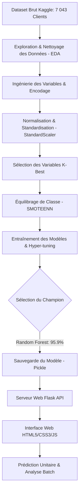
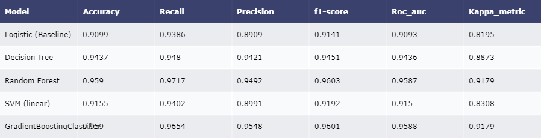
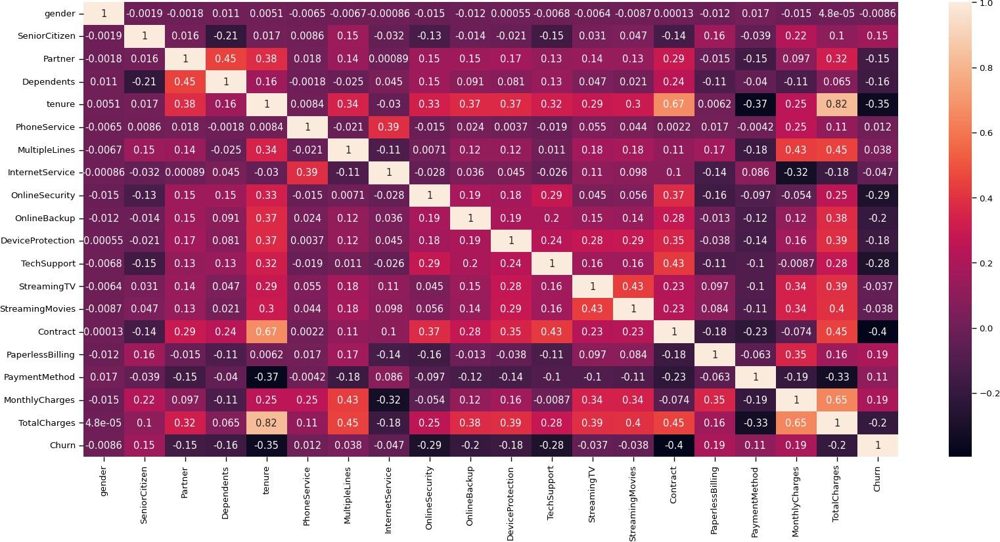
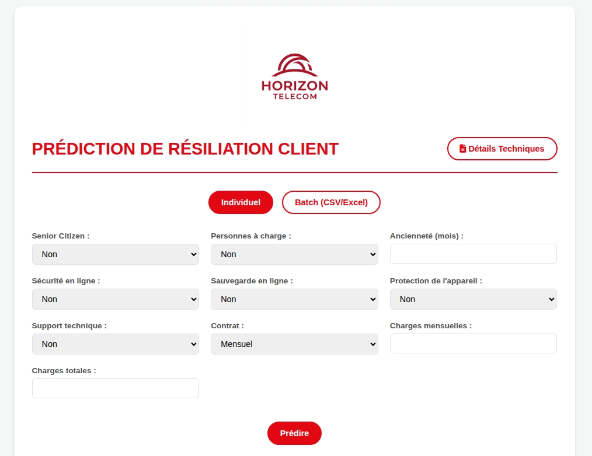
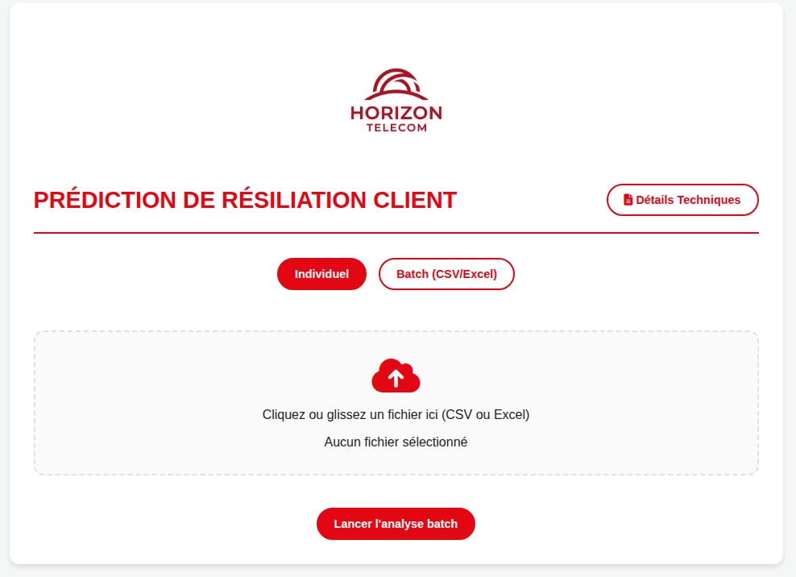

# 📡 Système Intelligent de Prédiction du Churn Client - Horizon Telecom

<p align="center">
  
</p>

Ce dépôt contient la solution complète et industrielle de prédiction du **Churn (attrition client)** développée pour l'opérateur **Horizon Telecom**. En s'appuyant sur des algorithmes d'apprentissage automatique (Machine Learning), cette application permet d'anticiper la perte de clients afin d'orchestrer des campagnes de fidélisation ciblées et proactives.

---

## 🎯 Problématique & Objectifs Métier

Le **Churn** (taux d'attrition) représente un défi financier majeur dans le secteur des télécommunications. Acquérir un nouveau client coûte en moyenne **5 à 7 fois plus cher** que d'en retenir un existant. 

L'objectif de ce projet est de :
1. Analyser les facteurs déterminants menant à la résiliation des clients.
2. Concevoir un modèle prédictif hautement précis (Target F1-Score > 90%).
3. Mettre à disposition des décideurs une **interface Web moderne et interactive** pour tester les profils de clients en temps réel (unitaire ou par lot).

---

## ⚙️ Architecture & Pipeline de Données

Le projet respecte la méthodologie standard **CRISP-DM**. Voici le flux de traitement des données :



---

## 🚀 Fonctionnalités de l'Application

* **Formulaire Prédictif Interactif (Unitaire) :** Permet de simuler le profil d'un client (ancienneté, charges mensuelles, services souscrits) pour connaître instantanément son risque de résiliation.
* **Barre Latérale de Démonstration :** Intègre 15 profils clients réels issus du dataset pour tester l'application en un seul clic.
* **Analyse Batch (Fichiers CSV/Excel) :** Permet de charger un fichier de centaines de clients et d'obtenir en sortie un tableau récapitulatif avec les statuts de prédiction mis en valeur par des badges de couleur.
* **Exportation des Résultats :** Téléchargement direct au format CSV des prédictions batch analysées.
* **Analyse Comparative des Modèles :** Page dédiée détaillant les avantages, inconvénients et métriques de chaque modèle de classification évalué.

---

## 📊 Performances du Modèle

Nous avons entraîné et comparé 5 modèles de Machine Learning sur un jeu de test (20%). Pour résoudre le fort déséquilibre de classe initial (74% vs 26%), la technique **SMOTEENN** (combinaison de SMOTE et d'Edited Nearest Neighbors) a été appliquée.

### Tableau Comparatif des Modèles

| Modèle | Exactitude (Accuracy) | Rappel (Recall) | Précision (Precision) | F1-Score | ROC AUC | Indice Kappa |
| :--- | :---: | :---: | :---: | :---: | :---: | :---: |
| Régression Logistique | 90.99% | 93.86% | 89.09% | 91.41% | 0.9093 | 0.8195 |
| Arbre de Décision | 94.37% | 94.80% | 94.21% | 94.51% | 0.9436 | 0.8873 |
| **Random Forest (Champion)** | **95.90%** | **97.17%** | **94.92%** | **96.03%** | **0.9587** | **0.9179** |
| SVM (Noyau Linéaire) | 91.55% | 94.02% | 89.91% | 91.92% | 0.9150 | 0.8308 |
| Gradient Boosting | 95.90% | 96.54% | 95.48% | 96.01% | 0.9588 | 0.9179 |

### Visualisations clés

<p align="center">
  
  <br><i>Figure 1 : Matrices de Confusion des modèles évalués</i>
</p>

### Facteurs Influents (Feature Importance)

La matrice de corrélation et l'importance des variables montrent que les facteurs critiques du désabonnement sont :
1. **Type de contrat :** Les abonnements au mois le mois sont extrêmement corrélés positivement au churn.
2. **Ancienneté (Tenure) :** Plus un client est installé chez l'opérateur, plus sa fidélité est élevée.
3. **Frais Mensuels :** Les charges financières élevées poussent les utilisateurs vers la concurrence.
4. **Services Additionnels :** L'absence d'assistance technique et de sécurité Internet multiplie le risque d'attrition.

<p align="center">
  
  <br><i>Figure 2 : Matrice de corrélation des variables clés du dataset</i>
</p>

---

## 🖥️ Aperçu de l'Interface Web

Le projet propose une interface moderne et fluide, animée avec Vanilla CSS et JavaScript.

<p align="center">
  
  
  <br><i>Figure 3 : Formulaire de simulation client (gauche) et interface d'analyse batch (droite)</i>
</p>

---

## 📁 Structure du Répertoire

* `project PFEdd/` : **Dossier de production principal** de l'application Flask (incluant l'onglet comparaison et l'optimisation des scripts).
* `project PFE/` : Version baseline/prototype de l'application.
* `images/` : Graphiques d'analyse de données (EDA) et de performance du modèle.
* `INSTRUCTIONS.md` : Guide d'installation et de lancement local pas-à-pas.
* `rapport_projetComplet.pdf` : Rapport académique complet du PFE.
* `Scripts_Parole_Churn_Telecom.pdf` : Notes et scripts de soutenance de projet.
* `QnA_Jury_Churn_Telecom.pdf` : Préparation aux questions-réponses du jury.

---

## 🛠️ Installation et Lancement

Pour lancer l'application de production (`project PFEdd`) sur votre machine :

### 1. Activer l'environnement et installer les dépendances
Ouvrez un terminal dans le dossier `project PFEdd` :
```bash
# Se déplacer dans le répertoire de production
cd "project PFEdd"

# Créer un environnement virtuel
python3 -m venv env

# Activer l'environnement
source env/bin/activate  # Sur Windows: env\Scripts\activate

# Installer les packages requis
pip install -r requirements.txt
```

### 2. Démarrer le serveur de développement Flask
```bash
python app.py
```
Accédez ensuite à l'adresse suivante dans votre navigateur web : **[http://127.0.0.1:5000](http://127.0.0.1:5000)**.

---

## 👥 Auteurs
* **Anas Haddou** - *Data Scientist & Développeur Lead*
* **Mohamed Amine Tayek** - *Data Scientist & Analyste*

*Projet de Fin d'Études réalisé dans le cadre du diplôme d'Ingénieur en Data Science.*
